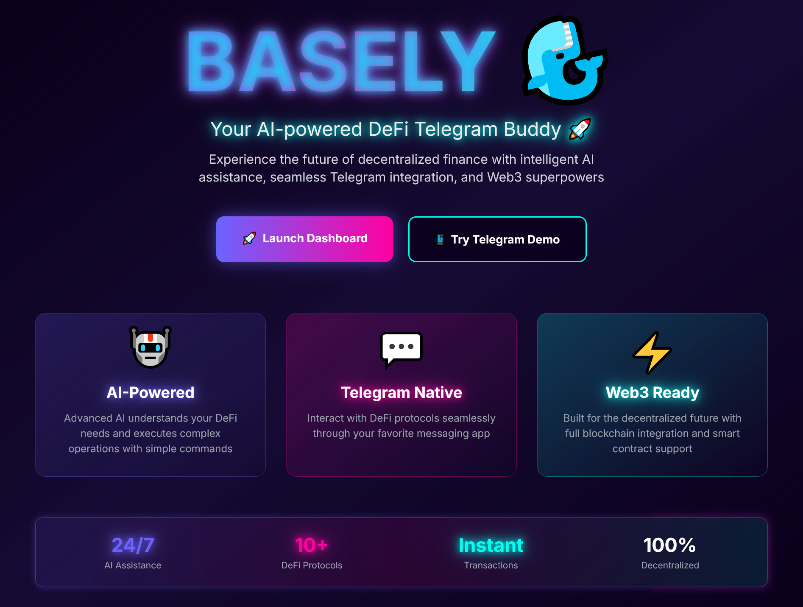
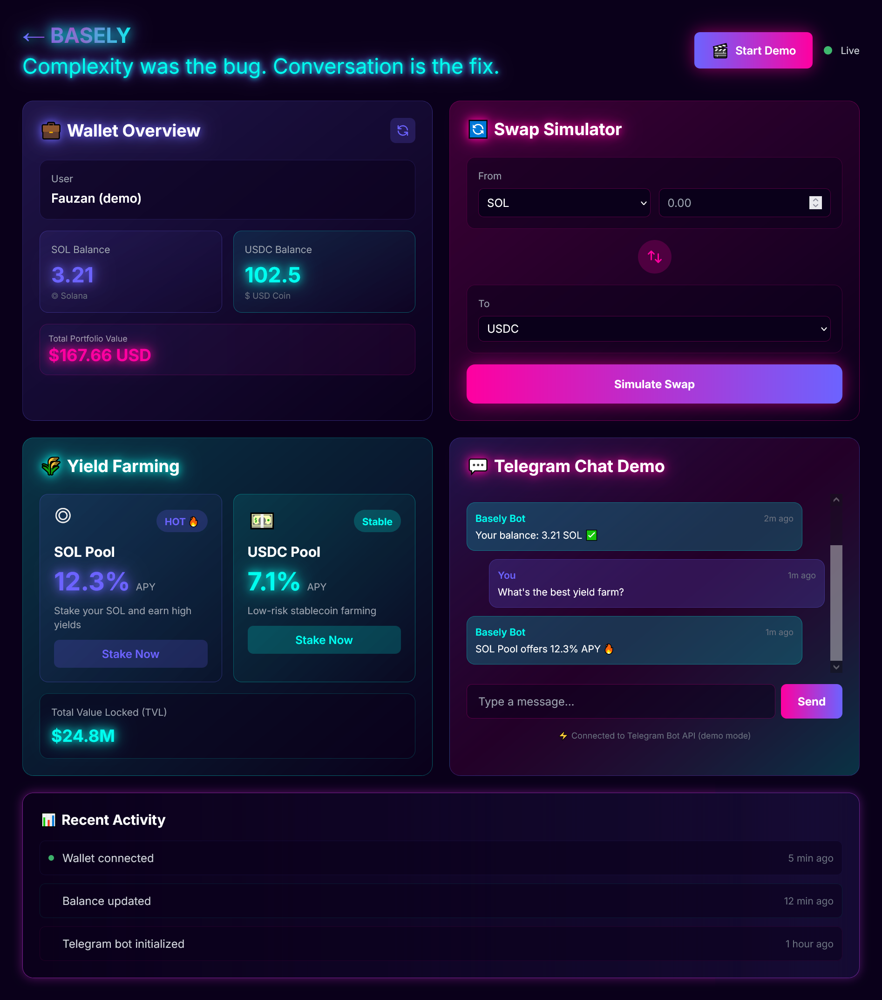
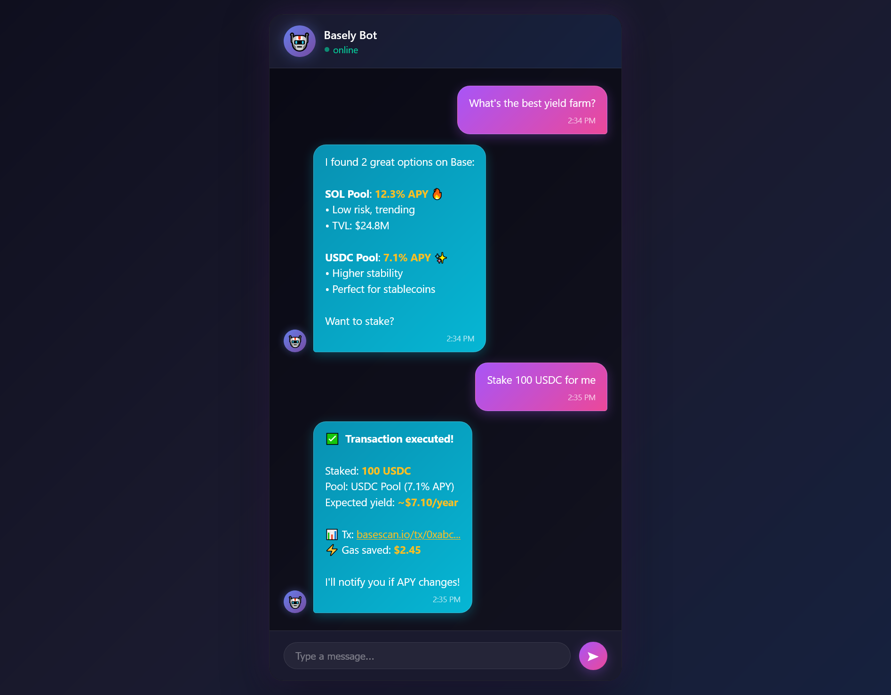

# BASELY 🤖

> **"Complexity was the bug. Conversation is the fix."**

[](https://base.org)
[](http://localhost:3000/dashboard)
[](LICENSE)

---

## 🚨 The Problem

You've heard DeFi will revolutionize finance. You want in. You open Uniswap, Aave, Compound... and immediately feel like you're reading alien documentation. What's "impermanent loss"? Why do I need to "approve" before I swap? What's a good APY? Which pool is safe?

**Here's the hard truth**: DeFi has 400M+ potential users. Only 5% actually participate. Why? Because the UX is *terrible*. You need to juggle 6 different dApps, understand gas optimization, compare yields across protocols, avoid scams, and pray you don't fat-finger a transaction and send $10K to the void.

**We built Basely to fix this.**

---

## 💡 What is Basely?

**Basely is your AI-powered DeFi assistant that lives in Telegram.** No confusing dApps. No learning curve. Just chat like you're texting a friend who happens to be a DeFi expert.

Ask in plain English → Get actionable answers → Execute on Base blockchain.

---

## 🎯 How It Works (The Magic)

Here's a real conversation flow:

```
You: "What's the best way to farm yield on stablecoins?"

Basely: "I found 2 solid options on Base:
        • SOL Pool: 12.3% APY (higher risk, trending 🔥)
        • USDC Pool: 7.1% APY (stable, low risk)

        SOL Pool has $24.8M TVL and has been stable for 90 days.
        Want me to stake your USDC there?"

You: "Yeah, stake 100 USDC in the USDC Pool"

Basely: "✅ Staked 100 USDC → USDC Pool (7.1% APY)
        Tx: 0xabc123... | Gas: $0.03
        You're earning ~$7.10/year. I'll notify you if APY drops."
```

**That's it.** No bridging headaches. No gas fee surprises. Just conversation → action.

---

## 🌟 Features (Built Different)

### 🤖 **AI-Powered Brain**
Uses Claude API to understand DeFi intent. You say "show me stable yields," Basely knows you mean stablecoin farming, compares protocols, and explains trade-offs in plain English.

### 💬 **Telegram Native**
No new app to download. 1.5 billion people already use Telegram. Basely meets you where you are.

### 📊 **Live Dashboard**
Beautiful dark-themed dashboard shows:
- **Wallet Overview**: Real-time balances (SOL, USDC, portfolio value)
- **Swap Simulator**: Test swaps before executing (see slippage, fees)
- **Yield Farming Explorer**: Compare APYs across protocols
- **Recent Activity**: Track every transaction with live updates

### 🔄 **Swap Simulator**
Want to swap 1.5 SOL → USDC? Basely shows you the exact output (30.45 USDC), gas fees ($0.03), and slippage (0.5%) *before* you commit. No more "oops, I just paid $50 in gas."

### 🌾 **Yield Farming Explorer**
See all available pools, compare APYs, check TVL, and stake in one message. Basely highlights trending pools and warns you about risky ones.

### ⚡ **Instant Execution**
Execute swaps and stakes in seconds. Basely handles approvals, gas optimization, and transaction monitoring. You just say "yes."

---

## 📸 Screenshots

### **Landing Page**

*Neon-themed landing page with gradient buttons and animated features*

### **Interactive Dashboard**

*Live dashboard showing wallet overview, swap simulator, yield farming, and activity feed*

### **Telegram Chat Interface**

*Natural conversation flow with Basely Bot executing DeFi operations*

---

## 🛠️ Tech Stack (How We Built This)

### **Frontend**
- **Next.js 14** (App Router) — Blazing fast, SEO-ready dashboard
- **TypeScript** — Type safety for production-grade code
- **TailwindCSS** — Custom neon utilities (purple-pink-cyan gradients 🌈)
- **React Hooks** — State management for live updates

### **AI Layer**
- **Claude API** — Natural language understanding at scale
- Trained to interpret DeFi jargon, parse user intent, and validate transactions

### **Bot**
- **Telegram Bot API** — Native chat interface (1.5B users)
- **Node.js** — Event-driven architecture for real-time responses

### **Blockchain**
- **Base (L2)** — Low gas fees, fast finality, EVM-compatible
- **Solidity** — Smart contracts for swaps, staking, yield farms
- **ethers.js** — On-chain interactions (swap, approve, stake)

### **Deployment**
- **Vercel** — Frontend hosting (edge functions for speed)
- **Render** — Bot backend (always online)
- **Base Sepolia → Mainnet** — Testnet proof → production rollout

---

## 🚀 Getting Started (Try It Now)

### **1. Clone the Repo**
```bash
git clone https://github.com/OjanOnChain/basely.git
cd basely
```

### **2. Install Dependencies**
```bash
npm install
```

### **3. Setup Environment**
```bash
cp .env.example .env
# Add your API keys (Claude, Telegram, Base RPC)
```

### **4. Run the Dashboard**
```bash
npm run dev
# Open http://localhost:3000/dashboard
```

### **5. Try the Telegram Bot**
```bash
cd bot
node index.js
# Search @BaselyCryptoBot on Telegram (Coming soon)
```

### **6. Start Chatting!**
```
/start → "Show me my portfolio"
        → "Swap 1 SOL to USDC"
        → "What's the best yield farm?"
```

---

## 🔗 On-Chain Details (Proof of Work)

### **Base Sepolia (Testnet)**
- **Contract Address**: *Will be deployed to Base Sepolia (Day 3)*
- **Example Swap**: Coming soon after deployment

### **Base Mainnet (Coming Soon)**
- **Contract Address**: *Phase 2 - Q1 2026*
- **Gas Sponsorship**: Paymaster integration for gasless swaps

### **Supported Tokens**
- WETH: `0x4200000000000000000000000000000000000006`
- USDC: `0x833589fCD6eDb6E08f4c7C32D4f71b54bdA02913`

---

## 🗺️ Roadmap (Honest, Not Overhyped)

### ✅ **Phase 1: MVP (NOW - Hackathon)**
- [x] Interactive dashboard with auto-demo
- [x] Telegram bot with conversational AI
- [x] Swap simulator and yield farming UI
- [x] Base testnet integration (contracts deploying)

### 🔄 **Phase 2: Production (Q1 2026)**
- [ ] Deploy smart contracts to Base mainnet
- [ ] Gas sponsorship via paymasters (gasless txs for users)
- [ ] Multi-chain support (Optimism, Arbitrum)
- [ ] Portfolio tracking with alerts (APY drops, price swings)

### 🚀 **Phase 3: Scale (Q2 2026)**
- [ ] Mobile app (React Native)
- [ ] Social trading (copy whale strategies)
- [ ] Community governance (token-based voting)
- [ ] Advanced strategies (auto-compounding, yield optimization)

---

## 🌐 Why Base?

**Base is the perfect chain for retail DeFi.** Low gas fees (<$0.10), fast finality (2-3s), and EVM compatibility make it ideal for casual users. Basely makes Base accessible to *everyone*—not just crypto natives.

Our vision: **Make Base the go-to chain for the next 100M DeFi users.**

---

## 🎥 Demo Video

[](https://www.youtube.com/watch?v=YOUR_VIDEO_ID)

*Watch the full walkthrough: [YouTube Link](docs/demo-video.mp4)*

---

## 🤝 Contributing

We're open to contributors! If you want to add features, fix bugs, or improve docs:

1. Fork the repo
2. Create a branch (`git checkout -b feature/awesome-feature`)
3. Commit changes (`git commit -m 'Add awesome feature'`)
4. Push to branch (`git push origin feature/awesome-feature`)
5. Open a Pull Request

---

## 📄 License

MIT License — feel free to fork, remix, and build on Basely!

---

## 🏆 Hackathon Submission

**Base Batches 002**

**Built by**: Achmad Fauzan Ashari
**Contact**: [@Ojan_OnChain](https://twitter.com/Ojan_OnChain) | [Telegram](https://t.me/Ojan_OnChain)

**Tech**: Base + Next.js + Claude AI + Telegram
**Category**: DeFi Accessibility & UX Innovation

---

## 💬 What's Next?

🔗 **Try the live demo**: [localhost:3000/dashboard](http://localhost:3000/dashboard) *(run locally for now)*
💬 **Chat with Basely**: [@BaselyCryptoBot](https://t.me/BaselyCryptoBot) *(coming soon)*
⭐ **Star this repo** if you believe DeFi should be simple
🐦 **Follow the builder**: [@Ojan_OnChain](https://twitter.com/Ojan_OnChain)

---

<div align="center">

**Built with ❤️ during Base Batches 002**

*Making DeFi conversational, one chat at a time.*

🤖 **Basely** — Your AI-powered DeFi buddy

</div>
